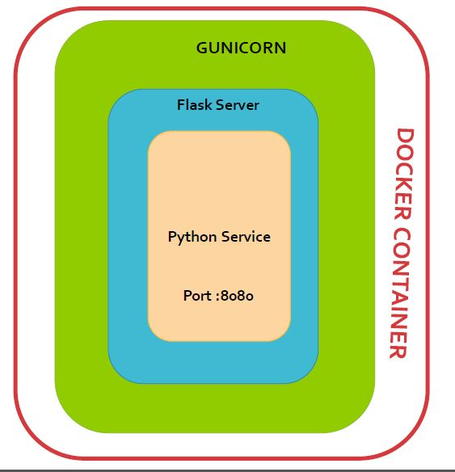

# Root Filter Microservice

### Introduction
This microservice is used to filter all the incoming requests.


##### What does root service do ?
- It autocompletes the incoming query with `show_more` flag and displays all the possible combinations of the same.
- By default it displays top 5 records.
- Further it takes query i.e. the searching criteria and `username` to redirect to the corresponding filter which is    configured in mongo_db and returns the result after filtering the output.

### Intents we support :
- performance 
- connectionleak
- changes
- junitresult
- sahifailedsummary
- sonar

  

### Pre-Requisites

1. python 3.6.0 or above version.
2. docker Refer [Install Docker](https://www.digitalocean.com/community/tutorials/how-to-install-and-use-docker-on-ubuntu-16-04) documentation.
3. [mongo-db] (https://www.mongodb.com/)


## Installation
### Checkout Repository
```
$git clone https://github.com/swiftops/root-service.git
```

##### Configuration

Steps :
1. Open system.properties edit database ip which is used to connect mongodb.

### 1. Deploy inside Docker
    
##### Steps to start microservice
Once done with pre-requisites, execute below command to start root microservice.
```
docker build -t <image-name>
docker run -p <port_mapping> --name <container_name> -d <image-name>
ex docker run  -p 8082:8082 --name ms-rootservice -d <image-name>
```


### 2. On Commit Auto-deploy on specific server.
---
To autodeploy your docker container based service on server used below steps
* Need to configure Gitlab Runner to execute Gitlab CI/CD Pipeline. See [Gitlab Config](https://docs.gitlab.com/runner/install)

As soon as you configure runner auto deployment will start as you commited the code in repository.
refer .gitlab-ci.yml file.


### 3. Deploy on local environment.
----
##### Pre-Requisite
* Open system.properties edit database ip
 
#### 3. Create Virtual Environment
Virtualenv is the easiest and recommended way to configure a custom Python environment for your services.
To install virtualenv execute below command:
```sh
$pip3 install virtualenv
```
Version can be verified for virtual environment with below command
```sh
$virtualenv --version
```
Create a virtual environment for a project:
```
$ cd <my_project_folder>
$ virtualenv virtenv
```
virtualenv `virtenv` will create a folder in the current directory which will contain the Python executable files, and a copy of the pip library which you can use to install other packages. The name of the virtual environment (in this case, it was `virtenv`) can be anything; omitting the name will place the files in the current directory instead.

This creates a copy of Python in whichever directory you ran the command in, placing it in a folder named `virtenv`.

You can also use the Python interpreter of your choice (like python3.6).
```
$virtualenv -p /usr/bin/python3.6 virtenv
```
To begin using the virtual environment, it needs to be activated:
```
$ source virtenv/bin/activate
```
The name of the current virtual environment will now appear on the left of the prompt (e.g. (virtenv)Your-Computer:your_project UserName$) to let you know that it’s active. From now on, any package that you install using pip will be placed in the virtenv folder, isolated from the global Python installation. You can add python packages needed in your microservice decelopment within virtualenv. 

#### Install python module dependanceies
```
pip install -r requirements.txt
```
#### To start microservice 
```
python services.py
```

### Architechture


##### Flask
Flask is a micro web framework written in Python. It is classified as a microframework because it does not require particular tools or libraries.It has no database abstraction layer, form validation, or any other components where pre-existing third-party libraries provide common functions. However, Flask supports extensions that can add application features as if they were implemented in Flask itself.
http://flask.pocoo.org/docs/1.0/quickstart/


##### Gunicorn
The Gunicorn "Green Unicorn" (pronounced gee-unicorn)[2] is a Python Web Server Gateway Interface (WSGI) HTTP server. 

###### Features
* Natively supports [WSGI] (https://wsgi.readthedocs.io/en/latest/what.html) , [web2py] (http://www.web2py.com/) and [Django] (https://www.djangoproject.com/).
* Automatic worker process management
* Simple Python configuration
* Multiple worker configurations
* Various server hooks for extensibility
* Compatible with Python 2.6+ and Python 3.2+[4]
http://docs.gunicorn.org/en/stable/configure.html


